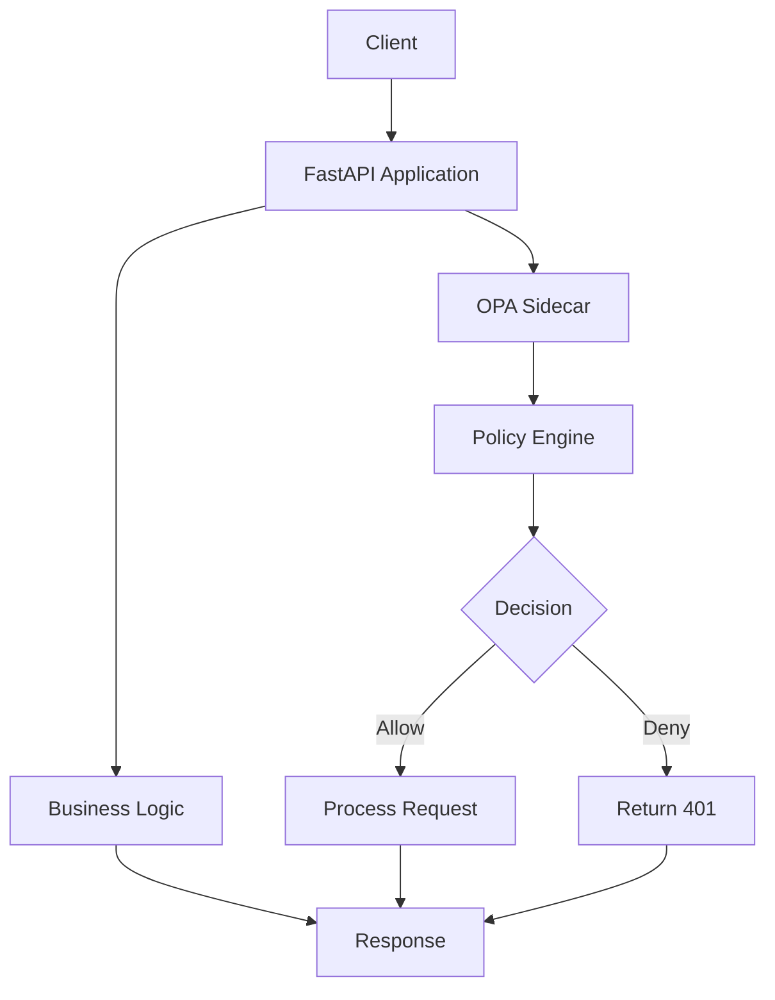

# 🚀 FastAPI with OPA in Kubernetes: A Comprehensive Guide to API Authorization

🔐 In today's microservices architecture, securing APIs has become a critical concern. Traditional authentication mechanisms often fall short when it comes to fine-grained authorization across distributed systems. This is where Open Policy Agent (OPA) shines as a powerful, context-aware policy engine that can be seamlessly integrated with your applications.

📚 This guide will walk you through implementing OPA as a sidecar container with a FastAPI application in Kubernetes, providing a robust, scalable solution for API authorization.

## 🌟 Why Use OPA as a Sidecar?

OPA offers several advantages when used as a sidecar:

1. **Decoupled Authorization**: Authorization logic is separated from application code, making it easier to manage and update policies without redeploying applications.

2. **Context-Aware Policies**: OPA can make decisions based on rich context including user roles, request paths, HTTP methods, and more.

3. **Language Agnostic**: OPA uses Rego, a declarative language specifically designed for policy authoring, making policies readable and maintainable.

4. **Real-time Policy Enforcement**: Policies are evaluated in real-time, ensuring immediate enforcement of security rules.

5. **Auditability**: OPA provides detailed logs of policy decisions, aiding in compliance and troubleshooting.

## 🏗️ Architecture Overview

The architecture consists of two containers running in the same Kubernetes Pod:



- **FastAPI Application**: The main application that handles HTTP requests and business logic.
- **OPA Sidecar**: A container running the OPA server that evaluates policies for each incoming request.

The FastAPI application integrates with OPA through middleware that intercepts requests before they reach the application logic. The middleware extracts relevant context (such as user roles and request path) and sends it to OPA for policy evaluation. Based on OPA's response, the middleware either allows the request to proceed or returns an unauthorized response.

## 💻 Implementation Details

### 1. OPA Policy Configuration

The core of our authorization system is the OPA policy defined in [`policy/admin.rego`](policy/admin.rego):

```rego
package sample

import future.keywords.if
import future.keywords.in

default allow = false

allow if {
    some i, "admin" in input.path
    some j, "ADMIN_ROLE" in input.roles
    "POST" == input.method
}

allow if {
    not "POST" == input.method
}
```

This policy implements the following rules:
- All HTTP methods except POST are allowed by default
- POST requests to paths containing "admin" are allowed only if the user has the "ADMIN_ROLE"

### 2. OPA Adapter

The OPA adapter (`app/adapters/opa_adapter.py`) provides a clean interface for communicating with the OPA server:

```python
import httpx
from typing import Dict, Any

class OPAAdapter:
    def __init__(self, opa_url: str):
        self.opa_url = opa_url
        self.client = httpx.AsyncClient()
    
    async def check_permission(self, input_data: Dict[str, Any]) -> bool:
        try:
            response = await self.client.post(
                self.opa_url,
                json={"input": input_data}
            )
            response.raise_for_status()
            result = response.json()
            return result.get("result", {}).get("allow", False)
        except Exception as e:
            raise Exception(f"OPA policy check failed: {str(e)}")
```

### 3. OPA Middleware

The middleware (`app/infrastructure/middleware.py`) intercepts requests and enforces policies:

```python
from fastapi import Request, Response
from fastapi.middleware.base import BaseHTTPMiddleware
from app.adapters.opa_adapter import OPAAdapter
from app.core.config import settings

class OPAMiddleware(BaseHTTPMiddleware):
    def __init__(self, app, opa_adapter: OPAAdapter):
        super().__init__(app)
        self.opa_adapter = opa_adapter
    
    async def dispatch(self, request: Request, call_next):
        # Skip OPA check for health endpoints
        if request.url.path.startswith("/health"):
            return await call_next(request)
        
        # Extract roles from header
        roles_header = request.headers.get("USER_ROLES", "")
        roles = roles_header.split(",") if roles_header else []
        
        # Prepare OPA input
        opa_input = {
            "path": request.url.path.split("/"),
            "roles": roles,
            "method": request.method
        }
        
        # Check permission
        is_allowed = await self.opa_adapter.check_permission(opa_input)
        
        if not is_allowed:
            return Response(
                content="Unauthorized",
                status_code=401
            )
        
        return await call_next(request)
```

### 4. Main Application Setup

The main application (`app/main.py`) initializes the OPA adapter and registers the middleware:

```python
from fastapi import FastAPI
from app.core.config import settings
from app.infrastructure.middleware import OPAMiddleware
from app.adapters.opa_adapter import OPAAdapter

app = FastAPI(title=settings.APP_NAME)

# Initialize OPA adapter
opa_adapter = OPAAdapter(settings.OPA_SERVER_URL)

# Add OPA middleware
app.add_middleware(OPAMiddleware, opa_adapter=opa_adapter)

# Include routes
from app.infrastructure.routes import router
app.include_router(router)

@app.get("/health/liveness")
async def liveness():
    return {"status": "alive"}

@app.get("/health/readiness")
async def readiness():
    return {"status": "ready"}
```

## 🐳 Kubernetes Deployment

The application is deployed in Kubernetes using the following manifests:

### Deployment Configuration (`k8s/deployment.yml`)

```yaml
apiVersion: apps/v1
kind: Deployment
metadata:
  name: fastapi-app
spec:
  replicas: 1
  selector:
    matchLabels:
      role: fastapi-app
  template:
    metadata:
      labels:
        role: fastapi-app
    spec:
      containers:
        - name: fastapi-app
          image: fastapi-opa-app:v1
          env:
            - name: OPA_SERVER_URL
              value: "http://opa-sidecar:8181/v1/data/sample"
          imagePullPolicy: IfNotPresent
          resources:
            limits:
              memory: 1Gi
          ports:
            - name: http
              containerPort: 8000
          livenessProbe:
            httpGet:
              port: http
              path: /health/liveness
            initialDelaySeconds: 20
            failureThreshold: 20
            periodSeconds: 1
          readinessProbe:
            httpGet:
              port: http
              path: /health/readiness
            initialDelaySeconds: 30
            failureThreshold: 2
            periodSeconds: 1
        - name: opa
          image: openpolicyagent/opa:1.9.0
          ports:
            - name: http
              containerPort: 8181
          args:
            - "run"
            - "--server"
            - "--addr=0.0.0.0:8181"
            - "/policies/admin.rego"
          volumeMounts:
            - readOnly: true
              mountPath: /policies
              name: example-policy
          livenessProbe:
            httpGet:
              scheme: HTTP
              port: 8181
            initialDelaySeconds: 5
            periodSeconds: 5
          readinessProbe:
            httpGet:
              path: /health?bundle=true
              scheme: HTTP
              port: 8181
            initialDelaySeconds: 5
            periodSeconds: 5
      volumes:
        - name: example-policy
          configMap:
            name: example-policy
```

### Service Configuration (`k8s/service.yml`)

```yaml
apiVersion: v1
kind: Service
metadata:
  name: fastapi-app
spec:
  type: NodePort
  ports:
    - port: 8000
      protocol: TCP
      targetPort: 8000
      nodePort: 30000
  selector:
    role: fastapi-app
```

## 🐳 Local Development

For local development, you can use Docker Compose:

### Docker Compose Configuration (`docker-compose.yml`)

```yaml
version: '3.8'

services:
  fastapi-app:
    build: .
    ports:
      - "8000:8000"
    environment:
      - OPA_SERVER_URL=http://opa-sidecar:8181/v1/data/sample
    depends_on:
      - opa-sidecar
    networks:
      - fastapi-opa-network

  opa-sidecar:
    build:
      context: .
      dockerfile: Dockerfile.opa
    ports:
      - "8181:8181"
    volumes:
      - ./policy:/policy
    networks:
      - fastapi-opa-network

networks:
  fastapi-opa-network:
    driver: bridge
```

### OPA Dockerfile (`Dockerfile.opa`)

```dockerfile
FROM openpolicyagent/opa:1.9.0

CMD ["run", "--server", "--addr=0.0.0.0:8181", "/policy/admin.rego"]
```

To run locally:
```bash
docker-compose up --build
```

## 🧪 Testing and Validation

### Expected Behavior

- GET requests to `/v1/admin/users/{userName}` should always succeed
- POST requests to `/v1/admin/users/{userName}` should succeed only if the `USER_ROLES` header contains "ADMIN_ROLE"
- All other requests should be denied with 401 Unauthorized

### Test Cases

1. GET request without roles: Should succeed
2. POST request without roles: Should return 401
3. POST request with ADMIN_ROLE: Should succeed
4. Health endpoints: Should always return 200

### Testing Commands

```bash
# Test GET request
curl -X GET http://localhost:8000/v1/admin/users/testuser

# Test POST request without roles
curl -X POST http://localhost:8000/v1/admin/users/testuser

# Test POST request with ADMIN_ROLE
curl -X POST http://localhost:8000/v1/admin/users/testuser -H "USER_ROLES: ADMIN_ROLE"
```

## 🛠️ Troubleshooting

### Common Issues

1. **OPA not responding**: Check if OPA container is running and accessible on port 8181
2. **Permission denied**: Verify the OPA policy is correctly loaded and the roles header is being passed
3. **Connection refused**: Ensure the OPA server URL is correctly configured in the environment variables

### Debugging Tips

- Check Kubernetes pod logs: `kubectl logs <pod-name> -c opa`
- Verify OPA policy is loaded: `curl http://localhost:8181/v1/policies`
- Test OPA directly: `curl -X POST http://localhost:8181/v1/data/sample -d '{"input": {"path": ["v1", "admin", "users"], "roles": ["ADMIN_ROLE"], "method": "POST"}}'`

## 🎯 Conclusion

Implementing OPA as a sidecar with FastAPI in Kubernetes provides a powerful, flexible solution for API authorization. This approach decouples authorization logic from application code, making it easier to manage security policies across your microservices architecture. The sidecar pattern ensures that authorization is consistently enforced across all services while maintaining the scalability and resilience of your Kubernetes deployment.

By following this guide, you can implement a robust authorization system that can be easily extended to handle more complex policy requirements as your application grows.

## 📚 References

- [Original article](https://medium.com/@subramanyasagar/using-open-policy-agent-as-a-sidecar-to-restrict-access-to-apis-d3f12a0345a3)
- [OPA Documentation](https://www.openpolicyagent.org/)
- [FastAPI Documentation](https://fastapi.tiangolo.com/)